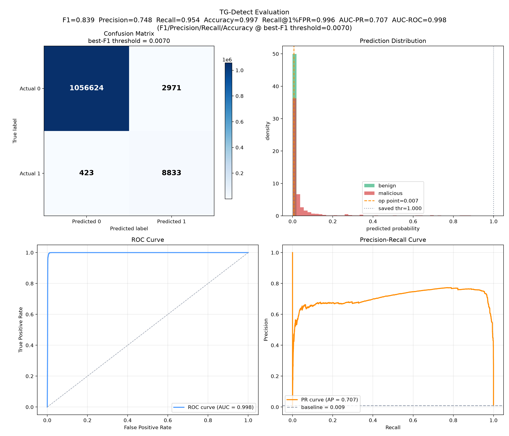

# TG-Detect — Temporal Graph Neural Network for Botnet / APT Detection

TG-Detect turns network (and host) telemetry into a **temporal graph** and flags malicious
activity with a per-snapshot **GraphSAGE** encoder, a **GRU** over time, and a **per-flow edge
classifier**. It ships two end-to-end paths: a local CPU pipeline for small runs, and a
[Modal.com](https://modal.com) GPU pipeline for training at scale.

## Headline result — CTU-13, held-out botnet family

Trained on 4 botnet families {Rbot, fast-flux/Virut, NSIS.ay, Sogou} and tested on a
**completely unseen family (donbot)** — a genuine generalization test, not in-distribution scoring:

| Metric | Value | Notes |
|---|---|---|
| **F1** | **0.839** | best-F1 operating point (threshold ≈ 0.007) |
| Precision / Recall | 0.748 / 0.954 | at best-F1 |
| Accuracy | 0.997 | at best-F1 |
| **Recall @ 1% FPR** | **0.996** | deployable fixed-alert-budget point |
| AUC-ROC / AUC-PR | 0.998 / 0.707 | threshold-free ranking quality |



> **Read before quoting F1.** The checkpoint's *saved* threshold (0.9999) is tuned on the
> in-distribution validation set and mis-transfers to the shifted test family, giving a
> misleading F1 = 0.0 there. The model's true best-F1 is **0.839**; the deployable
> operating point (1% FPR) gives F1 = 0.634 at 99.6% recall. Full explanation and the
> comparison to the IEEE Access 2025 base paper are in
> [`TG-DETECT-vs-BASE-PAPER-RESULTS.md`](TG-DETECT-vs-BASE-PAPER-RESULTS.md).

## How it works

The pipeline is five stages; each has a local script and a Modal entrypoint:

1. **Build** — parse raw logs into a typed temporal graph: **IP nodes**, **per-flow edges**
   with a 37-dim *leakage-free* feature vector (log-scaled bytes/pkts/duration/rates, protocol/
   state/direction one-hots, port **service buckets** — never raw ports). — `scripts/build_graph.py`
2. **Snapshots** — slice edges into **60 s sliding windows, 30 s stride**, *within a scenario*
   (scenarios are never merged onto one timeline). — `scripts/build_snapshots.py`
3. **Train** — per-snapshot `SAGEConv` → `GRU` across snapshots → edge classifier; imbalance-aware
   loss (capped `pos_weight`), **scenario-held-out** split, and a split manifest saved *inside* the
   checkpoint. — `scripts/train_tgnn.py`
4. **Evaluate** — reload the *exact* saved split from the checkpoint (train/eval can't disagree);
   report PR-AUC + recall@FPR and metrics at **three operating points** (saved / best-F1 / 1%-FPR).
   — `scripts/evaluate_tgnn.py`
5. **Visualize** — training curves, ROC / PR, confusion matrix, and interactive graph overview.
   — `scripts/plot_training.py`, `scripts/plot_evaluation.py`, `scripts/visualize_graph.py`

## Repository layout

```
graph_builder/        graph construction library (parsers, schema, temporal windows, loader)
  parsers.py            raw-log parsers incl. CTU-13 Argus NetFlow (.binetflow[.xz])
  schema.py             node/edge schema + typed feature columns
  temporal.py           leakage-free edge features + sliding-window snapshots
models/
  tgnn.py               TemporalGNN: SAGEConv encoder + GRU + edge/node heads
scripts/                CLI entrypoints for each pipeline stage (build/snapshot/train/eval/plot)
modal_train.py          Modal.com app: GPU training + parallel CPU build/snapshot/plot/download
models/checkpoints/     trained checkpoints (Mordor runs + CTU-13 ctu13_ho_c47)
reports/                result figures per run (training curves, eval plots, graph views)
requirements-graph.txt  deps for the graph layer (pandas/pyarrow/networkx/pyvis)
requirements-ml.txt     deps for the model layer (torch/torch-geometric/scikit-learn)
```

Key documents:
- [`CTU-13-DATASET-DETAILS.md`](CTU-13-DATASET-DETAILS.md) — the dataset, its 15 NetFlow
  fields/types, label rules, and how flows become the temporal graph.
- [`TG-DETECT-vs-BASE-PAPER-RESULTS.md`](TG-DETECT-vs-BASE-PAPER-RESULTS.md) — results vs. the
  IEEE Access 2025 base paper, and the three-operating-point metric methodology.
- [`TG-DETECT-ARCHITECTURE-v1.md`](TG-DETECT-ARCHITECTURE-v1.md) — full architecture writeup.
- [`TG-DETECT-BASE-PAPER-COMPARISON-ROADMAP.md`](TG-DETECT-BASE-PAPER-COMPARISON-ROADMAP.md) — roadmap.

## Install

The graph layer and the model layer have separate requirement sets (install graph first):

```sh
python -m pip install -r requirements-graph.txt
python -m pip install -r requirements-ml.txt   # torch / torch-geometric / scikit-learn
```

## Run — local (CPU, small datasets)

```sh
# 1. build a temporal graph from raw logs
python scripts/build_graph.py --dataset ctu13 --input <capture.binetflow.xz> --out data/processed/<name>
# 2. slice into snapshots
python scripts/build_snapshots.py --data data/processed/<name> --out data/snapshots/<name> --window-size 60 --stride 30
# 3. train (edge-level is the CTU-13 default)
python scripts/train_tgnn.py --snapshots data/snapshots/<name> --target edge --out models/checkpoints/<name>
# 4. evaluate on the checkpoint's own saved split
python scripts/evaluate_tgnn.py --checkpoint models/checkpoints/<name>/best_model.pt --out results/<name>
# 5. plot
python scripts/plot_evaluation.py --predictions results/<name>/predictions_test.parquet \
    --metrics results/<name>/metrics_test.json --out reports/<name>/evaluation_plots.png
```

## Run — Modal (GPU, full scale)

Raw captures live on the read-only Modal volume `mega-10gb-dataset`; outputs go to the writable
`tgdetect-data` volume. Training uses an A10G GPU; build/snapshot/eval/plot run on CPU.

```sh
modal run modal_train.py::smoke                       # cents-level CPU smoke test (one scenario)
modal run modal_train.py::build_ctu13_all             # parse all 13 captures in parallel (CPU)
modal run modal_train.py::snapshots --name ctu13_c47 --window-size 60 --stride 30
modal run modal_train.py::train_ho \                  # scenario-held-out GPU train (edge-level)
    --train-scenarios 'ctu13_c52,ctu13_c46,ctu13_c53,ctu13_c48' --test-scenarios 'ctu13_c47' \
    --out-name ho_c47 --target edge --epochs 30
modal run modal_train.py::evaluate_ho --out-name ho_c47 --split test
modal run modal_train.py::plots --ckpt-name ho_c47 --graph-name ctu13_c47
modal run modal_train.py::download --name ho_c47      # pull checkpoint + metrics + plots locally
```

## Datasets

- **CTU-13** (used for the headline result): 13 labeled bidirectional NetFlow captures (2011,
  7 botnet families). **Network telemetry.** Details in `CTU-13-DATASET-DETAILS.md`.
- **Mordor** (earlier runs under `models/checkpoints/mordor_*`): synthetic Windows/Sysmon event
  logs. **Host telemetry.**

## Notes & caveats

- Node features are intentionally **1-dimensional** (type-only) — every node is an IP, so all
  discriminative signal lives on the **edges**; using per-node degree/malicious-ratio would leak
  the label.
- Metrics under extreme class imbalance: prefer **AUC-PR** and **recall@fixed-FPR**; treat raw
  accuracy and the saved-threshold F1 with care (see the results doc).
- Continual learning (rehearsal / replay, the base paper's core contribution) is **not yet run** —
  it is the next planned phase.

